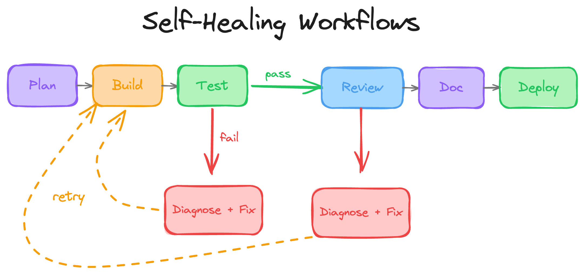
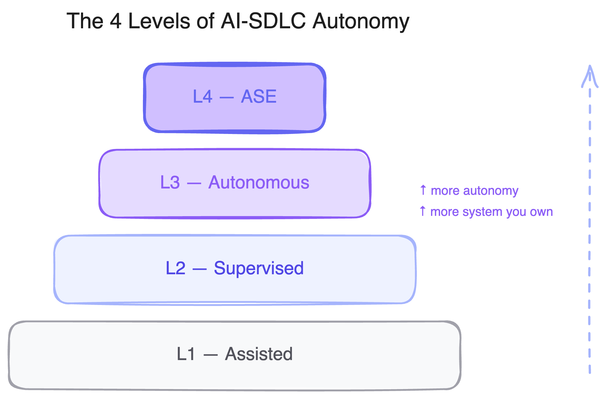

# Agentic Engineering Framework — Samples



Reference implementations of the **Agentic Engineering Framework (AEF)** — a framework for building the "agentic layer" that turns ad-hoc AI coding sessions into a repeatable engineering process.

📖 **[Read the guide](https://alejtraws.github.io/agentic-engineering-framework/workflow/build.html)** · 🗂️ **[Pick a sample](#samples)** · 🛠️ **[Customize the layer](#the-agentic-layer-what-you-customize)**

[](./LICENSE)
[](https://github.com/aws-samples)
[](https://github.com/aws-samples/sample-agentic-engineering-framework/commits)

<details>
<summary><b>Table of contents</b></summary>

- [What this repo is](#what-this-repo-is)
- [Samples](#samples)
- [Which sample should I start with?](#which-sample-should-i-start-with)
- [Sample 1 — `human-in-loop`](#sample-1--human-in-loop)
- [Sample 2 — `automated-kiro`](#sample-2--automated-kiro)
- [Sample 3 — `sprint-runner`](#sample-3--sprint-runner)
- [The agentic layer: what you customize](#the-agentic-layer-what-you-customize)
- [How each sample maps to the framework](#how-each-sample-maps-to-the-framework)
- [Prerequisites](#prerequisites)
- [Runtime output directories](#runtime-output-directories)
- [Customization](#customization)
- [Contributing](#contributing)
- [License](#license)

</details>

## What this repo is

AEF is a framework, not a tool. It defines the patterns: prompt templates, quality gates, feedback loops, workflow config. This repo contains **working samples** that show one way to build those patterns on top of specific agent runtimes. Pick a sample that matches where your team is today, then fork and adapt it.

**The AEF model in one paragraph.** An AEF-shaped workflow has three layers. The **agentic layer** is what your team writes and versions: prompt templates, quality gates, tool permissions, workflow config. The **workflow engine** reads that layer and executes it: phase orchestration, state management, self-healing loops, escalation. The **codebase** is where agents do their work: reading, writing, testing, shipping code. The quality comes from the templates and gates you write, not from reviewing every output.

**What a run looks like.** A typical run cycles through phases: Plan → Build → Test → Review → Document → Deploy. When Test fails, a self-healing loop patches and retries before escalating. When Review finds blockers, a patch loop re-implements and re-tests. Each phase produces structured artifacts that the next phase consumes. State persists across the run so nothing starts from scratch.

The full AEF framework defines two additional phases: **Intent** (upstream of Plan, normalizes the request) and **Monitor** (downstream of Deploy, closes the feedback loop). None of the samples in this repo materialize Intent as a dedicated phase yet, and Monitor is only partially covered (e.g. the `sprint-runner/claude/` live status server). Treat the 6-phase cycle above as the shape the samples implement, not the full framework surface.

## Samples

| Sample | Autonomy | Config style | Runner | Best for |
|---|---|---|---|---|
| [`human-in-loop`](./human-in-loop/) | L1 Assisted | Markdown checklists | Any agent | Learning the AEF patterns by hand |
| [`automated-kiro`](./automated-kiro/) | L1–L4 capable | Declarative YAML + engine | Kiro CLI | Running AEF autonomously, configurable per team |
| [`sprint-runner`](./sprint-runner/) | L3 Autonomous | Imperative Python + per-sprint state | Kiro CLI or Claude Code CLI | Installing AEF into existing repos; sprint-batch delivery with crash-resumable runs |

AEF defines four autonomy levels. **L1 Assisted**: human runs every phase, inspects every output. **L2 Supervised**: engine runs phases, human approves at checkpoints. **L3 Autonomous**: engine runs end-to-end, human reviews the resulting PR. **L4 ASE**: engine merges the PR. You move up the ladder as your gates and templates prove themselves, not by flipping a switch.

### Pattern × tech matrix

| Pattern | Kiro | Claude Code |
|---|---|---|
| Human-in-loop | [`human-in-loop/kiro/`](./human-in-loop/kiro/) | [`human-in-loop/claude/`](./human-in-loop/claude/) |
| Sprint runner | [`sprint-runner/kiro/`](./sprint-runner/kiro/) | [`sprint-runner/claude/`](./sprint-runner/claude/) |
| Automated | [`automated-kiro/`](./automated-kiro/) | — |
| Primitive agents | [`agent-samples/`](./agent-samples/) (tech-agnostic) | |

## Which sample should I start with?

```
Have you run an AEF-shaped workflow before?
├── no  → human-in-loop            (learn the shape by hand)
└── yes
    └── Are you working in an existing repo and want sprint-batch delivery?
        ├── yes → sprint-runner    (installer + crash-resumable orchestrator)
        └── no  → automated-kiro   (declarative workflow.yaml engine, L1–L4 via config)
```

## Sample 1 — `human-in-loop`

A sample Vite landing page paired with three markdown gate checklists. You invoke agents manually (`/agent plan`, `/agent build`, …), read their outputs, and evaluate the corresponding gate checklist before moving on. No orchestration code; you are the engine.

**Quick start (Kiro):**

```bash
cd human-in-loop/kiro
mkdir -p .kiro/agents
cp ../../agent-samples/agents/*.json .kiro/agents/
# Run each phase in order, evaluating the gate checklists between them
```

Agent configs for the Kiro variant live in [`agent-samples/`](./agent-samples/): six generic configs (plan, build, test, review, document, deploy) with matching prompt templates. The Claude variant ships its own `prompts/` and `agents/` folders; copy them into `.claude/commands/` and `.claude/agents/` instead.

See [`human-in-loop/README.md`](./human-in-loop/README.md) for the pattern overview and per-tech READMEs for the phase-by-phase flow.

## Sample 2 — `automated-kiro`

A sample FastAPI app paired with a complete agentic layer and workflow engine. The engine runs all phases in sequence, invokes Kiro CLI per phase, evaluates YAML-defined gates, runs self-healing loops on failure, and produces structured escalation reports when healing exhausts.

**Quick start:**

```bash
cd automated-kiro/agentic-layer
uv sync
uv run run.py --local --spec "Add a /users endpoint" --issue-type feature
```

Other triggers:

```bash
uv run run.py --api       # FastAPI server (default port 8002)
uv run run.py --webhook   # GitHub webhook receiver
uv run run.py --cron      # Poller for open GitHub issues
```

See [`automated-kiro/README.md`](./automated-kiro/README.md) for the full configuration reference.

## Sample 3 — `sprint-runner`

An agent-driven SDLC pipeline shaped around installing into an existing git repository and batching multiple sprint briefs per run. The runner processes each sprint through 9 stages (branch → research → plan → build → test → e2e → review → document → commit → publish) with crash-resumable state and self-healing patch loops on every gate. No target app ships inside the sample; you install into an external git repo you already own.

**Quick start (Kiro):**

```bash
python sprint-runner/kiro/agentic-layer/tools/install.py <target-project>
cd <target-project>
python tools/sprint_runner.py --list-sprints
python tools/sprint_runner.py --sprint 03
```

**Quick start (Claude Code):**

```bash
cp -r sprint-runner/claude/.claude  <target-project>/
cp -r sprint-runner/claude/tools    <target-project>/
cd <target-project>
python tools/sprint_runner.py --list-sprints
python tools/sprint_runner.py --sprint 03
```

See [`sprint-runner/README.md`](./sprint-runner/README.md) for the pattern overview and per-tech READMEs for the full stage reference and installer/runner CLI details.

## The agentic layer: what you customize

Every sample includes an `agentic-layer/` directory. This is the artifact your team maintains.

- **Prompts** (`prompts/*.md`) — one template per phase. Defines role, context, constraints, output format. Versioned with your code. Diff-friendly. Reviewable in PRs.
- **Gates** (`gates/*.yaml` or `gates/*.md`) — pass/fail criteria per phase. Test coverage thresholds, review severity rules, deploy-readiness checks. A failed gate triggers healing loops before escalating.
- **Tool permissions** (`tools/*.yaml`) — which tools each phase can access. Planners get read-only; builders get full access. Enforces least-privilege at the phase boundary.
- **Workflow config** (`workflow.yaml`) — phase ordering, loop retry limits, escalation rules. One file reshapes the entire pipeline.

When output quality drops, fix the layer, not the generated code. Patching the output treats the symptom. Improving the template treats the cause.

## How each sample maps to the framework



All three samples produce structured artifacts per phase and chain them forward. All enforce phase-separated tool permissions. All support self-healing: manually in `human-in-loop`, automatically in `automated-kiro` and `sprint-runner`. They differ in where the engine lives and how the agentic layer is configured.

The rows below trace AEF **concepts** (engine, phase ordering, artifact chaining, healing loops, gates, escalation, disposition), not the framework's eight phases. Phase coverage is a separate question: no sample currently implements Intent, and Monitor is only partially covered by `sprint-runner/claude/`'s live status server. Treat the table as a concept-level map, not a phase-by-phase audit.

| AEF concept | `human-in-loop` | `automated-kiro` | `sprint-runner` |
|---|---|---|---|
| Workflow engine | Human reads README and runs phases | `engine/runner.py` (PipelineRunner class) | `tools/sprint_runner.py` (SprintExecutor class) |
| Phase ordering | Documented prose | `workflow.yaml` phases list | Hard-coded `STEP_ORDER` in `SprintExecutor.run()` |
| Artifact chaining | Human copy-paste between conversations | `${plan_artifact}` → `${build_artifact}` substitution in templates | File-path handoff via per-sprint `state.json` payloads |
| Test retry loop | Human pastes failures into builder agent | `run_healing_loop()` with configurable max retries | `test_patch_max` cycle cap with regenerated patch specs |
| Review patch loop | Human pastes findings into builder agent | `run_healing_loop()` with `strategy: patch` | `review_patch_max` cycle cap; generates `specs/patch/patch-sprint-<id>-review-<n>.md` |
| Gate evaluation | Human checks markdown checkboxes | `GateEvaluator` evaluates YAML criteria | Structured JSON status checks per step (test/e2e/review result files) |
| Escalation | Continuous — human is always present | `handle_escalation()` writes forensic markdown | `MERGE_CONFLICT.md` + `merge-outcome.json` in the run dir |
| Disposition | Human decides after each phase | Per-gate config, varies by autonomy level | Cycle caps in `pipeline.yaml` |

### `sprint-runner` vs `automated-kiro`

The two Kiro-based samples cover distinct operating models. Use this table to pick between them:

| Dimension | `automated-kiro` | `sprint-runner` |
|---|---|---|
| Orchestration style | Declarative `workflow.yaml` interpreted by an engine | Imperative Python (`STEP_ORDER` in `SprintExecutor.run()`) |
| Unit of work | A single GitHub issue per run | A sprint backlog (one or many sprints per run) |
| Target location | Bundled FastAPI demo app inside the sample | External git repo; no bundled app |
| Python deps | `uv` + pydantic + pyyaml + fastapi + uvicorn | Stdlib only — no `pip install` |
| Triggers | CLI + API server + GitHub webhook + cron poller | CLI only |
| GitHub integration | `gh` CLI for PR creation; webhook receives issues | Git subprocess only; no `gh`, no webhooks |
| State model | Manifest-based via `engine/manifest.py` | Atomic `state.json` + `RUNNING.lock` heartbeat; crash-resumable via `--resume` / `--resume-from` |
| Install model | Copy `agentic-layer/` into your project | `python install.py <target>` scaffolds `.kiro/` + `tools/` automatically |

## Prerequisites

<details>
<summary><b>Common + per-sample prerequisites</b></summary>

**Common:**
- Node.js 18+ — for the `human-in-loop` sample app
- Kiro CLI on PATH, or `KIRO_CLI_PATH` env var — for `automated-kiro`

**`automated-kiro`:**
- Python 3.11+ and `uv` package manager
- `gh` CLI with a valid token, if you use the Deploy phase's PR creation

**`sprint-runner` (Kiro variant):**
- Python 3.11+ (stdlib only — no `pip install` needed)
- `kiro-cli` on `PATH`
- An existing git repository to install into
- Optional: `npx` for Playwright MCP used by the test/e2e/review browser role

**`sprint-runner` (Claude Code variant):**
- Python 3.11+ (stdlib only — no `pip install` needed)
- `claude` CLI on `PATH`
- An existing git repository to install into

</details>

## Runtime output directories

<details>
<summary><b>Directories produced at runtime (add to .gitignore)</b></summary>

| Directory | Contents |
|---|---|
| `agent_runs_log/` | Execution logs, prompt audit trails, and manifests per run |
| `specs/` | Implementation plans generated by the Plan phase |
| `ai_docs/` | Documentation generated by the Document phase and KPI reports |
| `.developer/sprint-runs/` | Per-run `state.json`, step logs, patch specs, and merge outcomes (`sprint-runner` target projects) |

</details>

## Customization

Each sample's `agentic-layer/` is designed to be forked and modified.

- **Prompts** — edit the markdown templates to change how each phase behaves
- **Agents** — add or modify persona files to create specialized roles
- **Gates** — define new quality gates with custom criteria and healing strategies
- **Workflow** — edit `workflow.yaml` to add or remove phases, change gate bindings, or adjust retry limits

The most team-specific prompt surface is the `## Plan Format` section inside each planning prompt. Every team formats implementation plans differently. The samples ship an opinionated default with an invariants contract (what the rest of the pipeline depends on) and a safe-to-change list (what you can reshape). See the relevant sample's README for prompt-level customization guidance; [`sprint-runner/README.md`](./sprint-runner/README.md) covers this in depth.

The code is output. The agentic layer is the product. Improve a template and every future run benefits. Tighten a gate and every future build is held to the new standard. That's where the leverage is.

## Contributing

See [CONTRIBUTING.md](./CONTRIBUTING.md) for contribution guidelines and the [Code of Conduct](./CODE_OF_CONDUCT.md).

## License

This library is licensed under the MIT-0 License. See [LICENSE](./LICENSE).
